# UML Diagramme - OnlineShop

🛒 **UML Diagramme - OnlineShop**  
**Projekt:** OnlineShop | **Autor:** Karpenko Viktor

**Technologie-Stack:** Java 21 · Spring Boot 4.0.6 · Spring Security 6 · Thymeleaf · MySQL 8.0 · Flyway V1–V7 · Docker

---

## 1. Entity-Klassen und ihre Beziehungen

Dieses Diagramm zeigt alle Daten-Entitäten des Online-Shops und deren Beziehungen. Neu seit letzter Version: OAuth2-Felder in `User`, Soft-Delete + Optimistic Locking in `Product`.

```mermaid
classDiagram
direction TB

class User {
    -id: Long
    -email: String
    -passwordHash: String
    -role: Role
    -status: UserStatus
    -firstName: String
    -lastName: String
    -address: String
    -createdAt: LocalDateTime
    -authProvider: AuthProvider
    -providerId: String
}
class AuthProvider {
    <<enumeration>>
    LOCAL
    GOOGLE
}
class Role {
    <<enumeration>>
    USER
    ADMIN
}
class UserStatus {
    <<enumeration>>
    ACTIVE
    BLOCKED
}
class Category {
    -id: Long
    -name: String
    -description: String
    -slug: String
    -createdAt: LocalDateTime
}
class Product {
    -id: Long
    -name: String
    -description: String
    -price: BigDecimal
    -stock: Integer
    -imageUrl: String
    -category: Category
    -deleted: boolean
    -version: Integer
    -createdAt: LocalDateTime
    -updatedAt: LocalDateTime
}
class Cart {
    -id: Long
    -user: User
    -items: List~CartItem~
}
class CartItem {
    -id: Long
    -cart: Cart
    -product: Product
    -quantity: Integer
}
class Order {
    -id: Long
    -user: User
    -orderDate: LocalDateTime
    -totalAmount: BigDecimal
    -status: OrderStatus
    -deliveryAddress: String
    -orderItems: List~OrderItem~
}
class OrderItem {
    -id: Long
    -order: Order
    -product: Product
    -quantity: Integer
    -unitPrice: BigDecimal
}
class OrderStatus {
    <<enumeration>>
    NEW
    CONFIRMED
    SHIPPED
    CANCELLED
}
class Favorite {
    -id: Long
    -user: User
    -product: Product
    -createdAt: LocalDateTime
}
```

---

## 2. Service-Schicht (Business-Logik)

Alle Services sind zustandslos (Stateless) und über `@Transactional` abgesichert. `OrderService.checkout()` ruft `CartService`, `ProductRepository` und `PriceCalculatorService` auf.

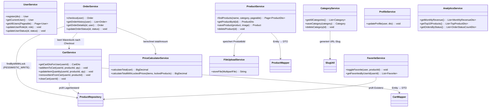

---

## 3. Schichtenarchitektur (Layered Architecture)

Klassische 3-Schichten-Architektur mit klaren Verantwortlichkeiten. Cross-Cutting Concerns (Security, Exception Handling, Logging) sind horizontal integriert.

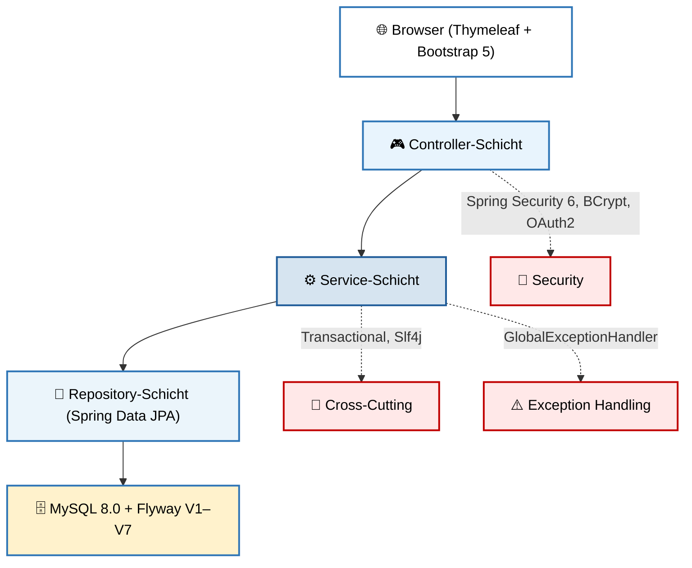

---

## 4. Prozess: Bestellaufgabe (Checkout) mit Pessimistic Locking

Der Checkout läuft in einer einzigen `@Transactional`-Transaktion ab. Neu: Pessimistic Locking (`PESSIMISTIC_WRITE`) verhindert Overselling bei parallelen Bestellungen.

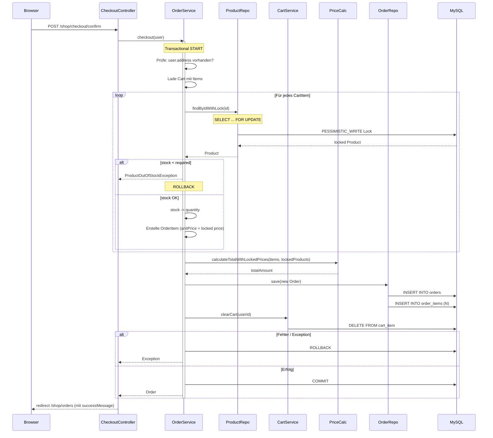

---

## 5. Prozess: Produktsuche und Filterung (Specification Pattern)

Dynamische Queries via `ProductSpecification` kombinierbar mit `Specification.where(...).and(...)`. Soft-Delete-Filter immer aktiv.

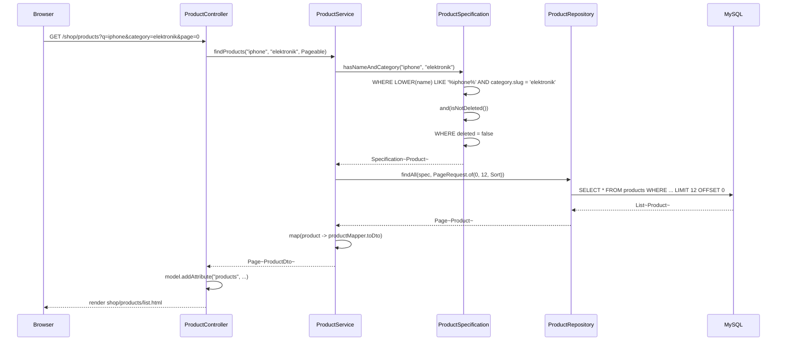

---

## 6. Use-Case Diagramm

Übersicht aller Funktionalitäten aus Sicht der Benutzer. Neu: OAuth2-Login (Google) als optionale Alternative.

```mermaid
graph TD
    USER["👥 Endkunde (USER)"]
    ADMIN["👥 Administrator"]

    USER --> UC1["Registrieren (E-Mail + Passwort)"]
    USER --> UC2["Login / Logout (Session)"]
    USER --> UC2a["OAuth2 Login (Google)"]
    USER --> UC3["Produktliste durchsuchen"]
    USER --> UC4["Produktdetails anzeigen"]
    USER --> UC5["Warenkorb verwalten"]
    USER --> UC6["Bestellung aufgeben (Checkout)"]
    USER --> UC7["Bestellhistorie einsehen"]
    USER --> UC8["Favoriten verwalten (Toggle)"]
    USER --> UC9["Profil bearbeiten"]

    ADMIN --> UC2
    ADMIN --> UC10["Produkte verwalten (CRUD + Bild)"]
    ADMIN --> UC11["Kategorien verwalten"]
    ADMIN --> UC12["Bestellungen verwalten"]
    ADMIN --> UC13["Benutzer verwalten (sperren/Rolle)"]
    ADMIN --> UC14["Analysen einsehen (Chart.js)"]
    ADMIN --> UC15["CSV-Export"]

    style USER fill:#EBF5FB,stroke:#2E75B6,stroke-width:2px,color:#000000
    style ADMIN fill:#EBF5FB,stroke:#2E75B6,stroke-width:2px,color:#000000
    style UC10 fill:#FFF2CC,stroke:#2E75B6,stroke-width:2px,color:#000000
    style UC11 fill:#FFF2CC,stroke:#2E75B6,stroke-width:2px,color:#000000
    style UC12 fill:#FFF2CC,stroke:#2E75B6,stroke-width:2px,color:#000000
    style UC13 fill:#FFF2CC,stroke:#2E75B6,stroke-width:2px,color:#000000
    style UC14 fill:#FFF2CC,stroke:#2E75B6,stroke-width:2px,color:#000000
    style UC15 fill:#FFF2CC,stroke:#2E75B6,stroke-width:2px,color:#000000
    style UC2a fill:#D4EDDA,stroke:#198754,stroke-width:2px,color:#000000
```

⭐ = Wunschkriterium (realisiert)

---

## 7. Datenbankschema (Entity-Relationship)

Flyway-Migrationen V1–V7 erstellen diese Tabellen automatisch beim Applikationsstart.

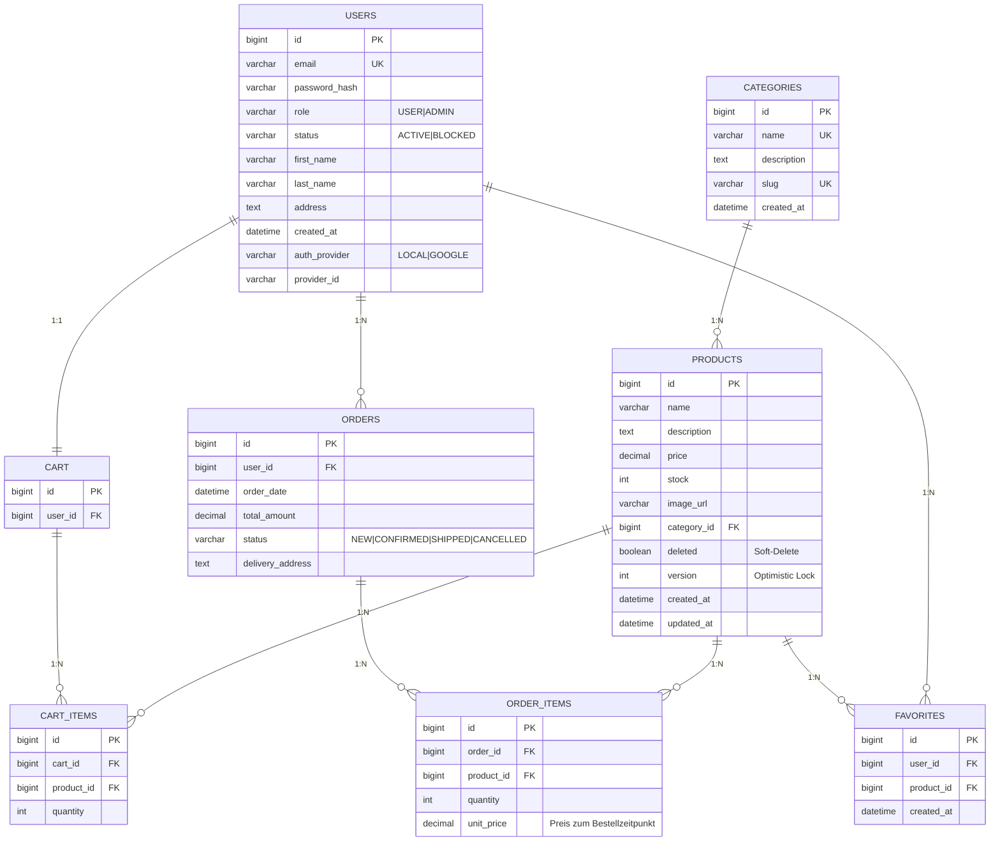

---

## 8. Security-Flow (Spring Security 6 + OAuth2)

Zwei parallele Authentifizierungswege: klassischer Form-Login mit BCrypt und optionaler OAuth2-Flow über Google.

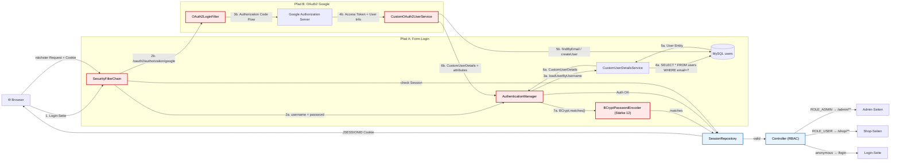

---

## 9. Exception Handling (GlobalExceptionHandler)

`@ControllerAdvice` fängt alle Exceptions zentral ab und rendert passende Fehlerseiten. Neu: HTTP 409 für Out-of-Stock und Email-Exists.

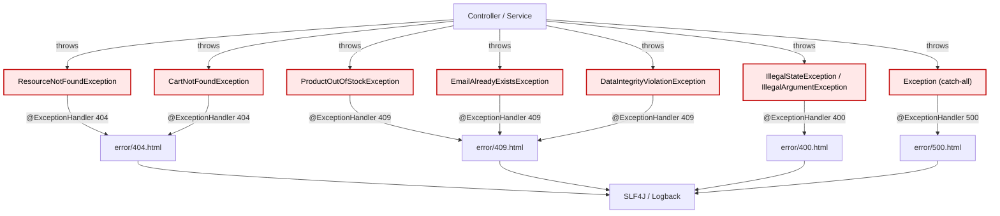

---

## 10. Order Status State Machine

Der `OrderService` validiert Statusübergänge. Nicht alle Transitionen sind erlaubt (z.B. CANCELLED → CONFIRMED ist verboten).

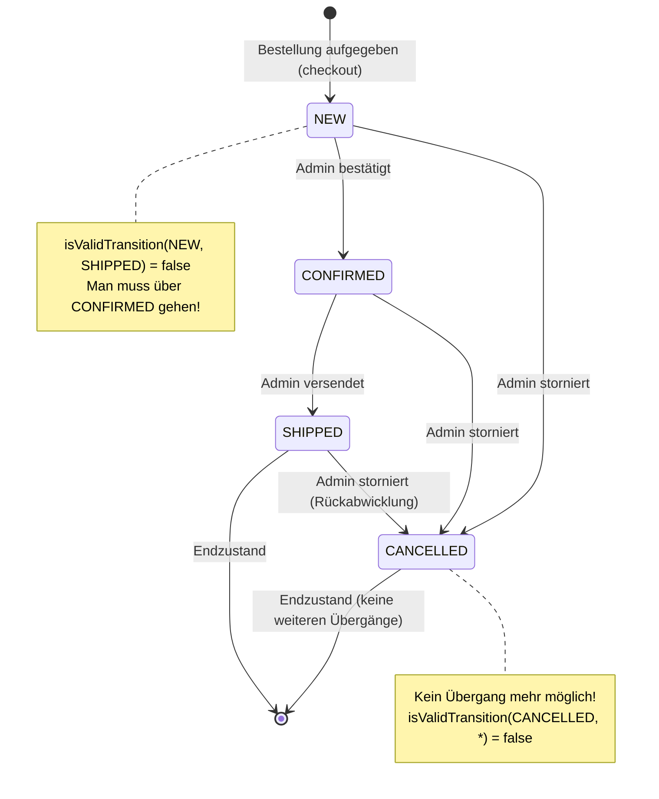

---

## 11. OAuth2 Login Flow (Google)

Detaillierter Ablauf des OAuth2-Logins. `CustomOAuth2UserService` erstellt automatisch neue User oder verknüpft bestehende.

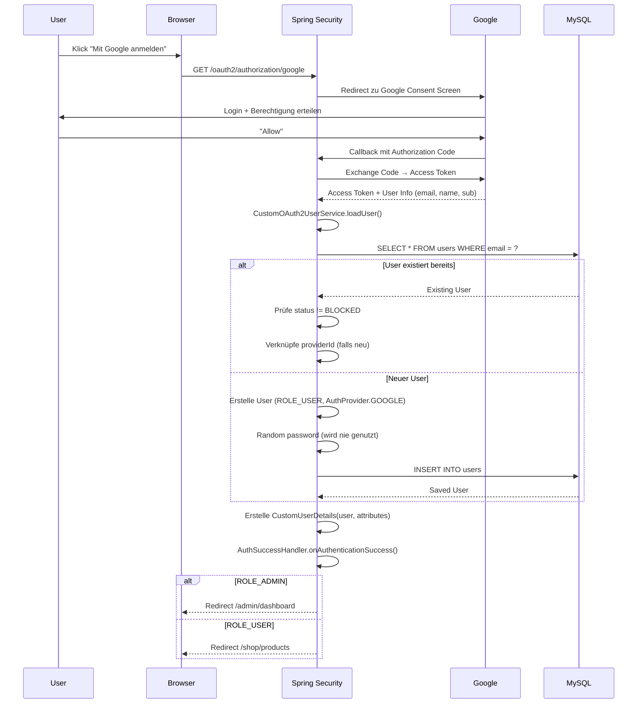

---

## 12. Favorite Toggle mit Race-Condition-Handling

Der `FavoriteService` nutzt eine "check-then-act"-Logik. Ein UNIQUE-Constraint auf DB-Ebene fängt Duplikate ab, falls zwei Requests parallel eintreffen.

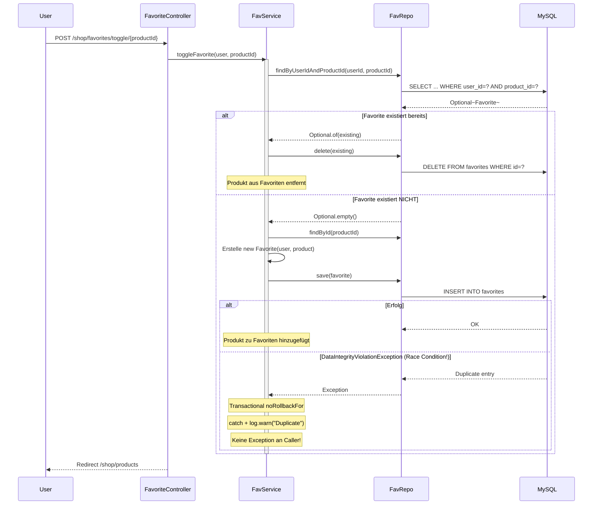

---

## 13. Docker Deployment

Orchestrierung via `docker-compose.yml` mit Healthchecks, Named Volumes und isoliertem Bridge-Network.

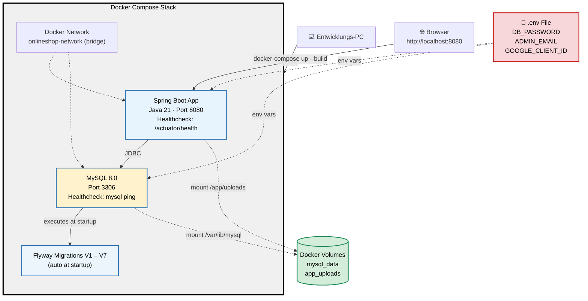

🔐 **Sicherheit im Docker-Deployment:**

- Alle sensiblen Daten (Passwörter, OAuth2-Credentials) kommen aus der `.env`-Datei — nie im Code hartcodiert.
- `.env` ist in `.gitignore` eingetragen.
- Admin-Credentials werden beim ersten Start automatisch angelegt (`DataInitializer`).

---

## 14. Flyway Migrations-Übersicht

```mermaid
graph LR
    V1["V1: users"] --> V2["V2: categories"]
    V2 --> V3["V3: products"]
    V3 --> V4["V4: orders + order_items"]
    V4 --> V5["V5: cart + cart_item"]
    V5 --> V6["V6: favorites"]
    V6 --> V7["V7: initial data"]

    style V1 fill:#E8F4FD,stroke:#2E75B6,color:#000000
    style V2 fill:#E8F4FD,stroke:#2E75B6,color:#000000
    style V3 fill:#E8F4FD,stroke:#2E75B6,color:#000000
    style V4 fill:#E8F4FD,stroke:#2E75B6,color:#000000
    style V5 fill:#E8F4FD,stroke:#2E75B6,color:#000000
    style V6 fill:#E8F4FD,stroke:#2E75B6,color:#000000
    style V7 fill:#D4EDDA,stroke:#198754,color:#000000
```

---

**Projekt Level 2** | **Karpenko Viktor** | **22.06.2026**

Alle Diagramme wurden mit [Mermaid](https://mermaid.js.org/) generiert.

**Letzte Aktualisierung:** Umsetzung von OAuth2-Login, Pessimistic Locking, Soft-Delete und Flyway V7 berücksichtigt.